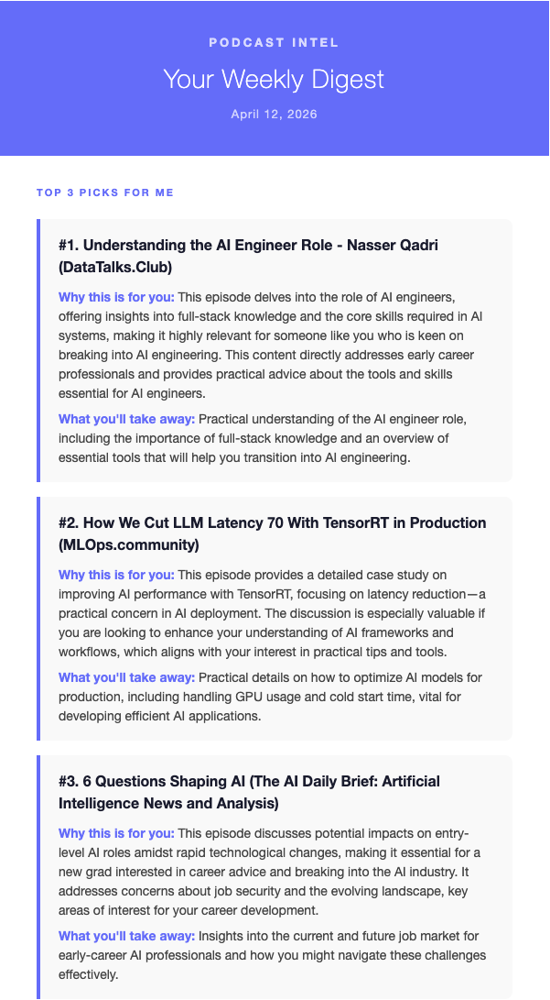
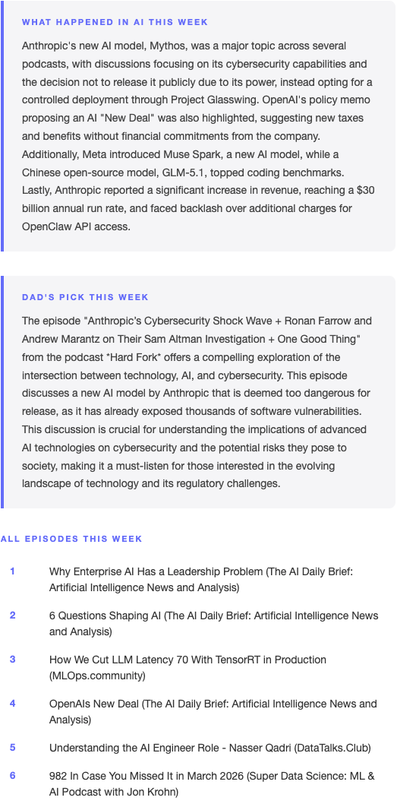
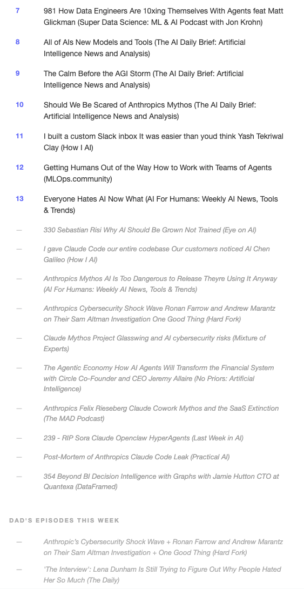
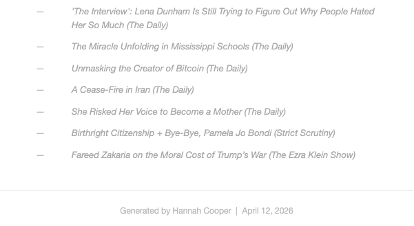

# Podcast Intel RAG

I absolutely love podcasts! They are how I stay up-to-date on everything I am interested in, from daily news (Up First by NPR and The Daily), biotechnology advancements (The Readout Loud), UK-specific news (Pod Save the UK, since I'm currently based in the UK), and health policy (Health Affairs This Week). Beyond being an avid daily and weekly listener to these shows, I have been obsessed with data & AI related content. I started out loving the DataFramed podcast by DataCamp, but stumbled upon other interesting shows (How I AI, The AI Daily Brief, and many more - see `podcasts.py`). It would take far too much time to listen to every episode from every podcast. Even manually searching up each podcast to see the titles and descriptions of all episodes for the week is extremely time consuming and unrealistic for 20+ shows (some of which post multiple times a week). Additionally, certain topics that are mentioned during the show (e.g. advice for earlier careers) likely wouldn't be in the description of the episode, but it something I would definitely want to listen to.

To solve my problem, I built this end-to-end RAG pipeline that injests transcripts from 20+ podcasts weekly, searches them based on my interests, and emails me the top 3 relevant episodes for me to listen to. The pipeline also generates a short summary of news topics that are mentioned across podcasts - giving me insight into the top AI stories and advancements. My dad is also an avid podcast listener, so I added his 4 favorite shows and have the digest recommend whichever episode that week we would relate the most on!

Through this project, I have got hands-on experience with RAG systems, vector embeddings, and AI evaluation. It's been a really fun project to work on, and listening to my recommended podcasts has become one of my favorite parts of my weekly routine :) I have been learning so many interesting things through these podcasts - from how tools like Claude Code and OpenClaw were built, to exciting AI applications in real-world evidence and SAS/R programming in pharma & biotechnology (my current role), to the latest agent frameworks and startups. The exposure to practical AI workflows has directly shaped how I work - I have been focused on developing reusable agent skills and workflows that I have been presenting to my colleagues to accelerate how our team works. It is honestly so much fun!!!

## What it does

Every week, the pipeline:

1. Fetches new episodes from 20+ AI/ML podcast RSS feeds
2. Downloads and transcribes audio using Whisper
3. Chunks transcripts and stores embeddings in Supabase via pgvector
4. Runs multi-query vector search weighted by my defined interests
5. Scores episodes by how many relevant chunks they contributed and selects the top 6
6. Asks GPT-4o to pick the top 3 from those 6 and explain why each one fits my interests
7. Generates a weekly AI news summary from news podcast descriptions
8. Picks a recommendation from my dad's 4 podcast feeds based on the best tech/politics angle that week
9. Emails the digest with all episodes listed from most to least relevant, so I can easily skim titles and decide what else to listen to

It also validates data quality after each run and emails an alert if anything looks off (missing fields, episodes with no chunks, etc.), and tracks retrieval quality over time using RAGAS context precision scoring.

## Stack

- **Whisper**: audio transcription
- **OpenAI**: embeddings (`text-embedding-3-small`) and recommendations (`gpt-4o`)
- **Supabase + pgvector**: vector storage and similarity search
- **RAGAS**: retrieval evaluation (context precision)
- **GitHub Actions**: weekly scheduled pipeline runs
- **Python**: everything else

## How retrieval works

Episodes are scored by running several weighted queries against the transcript embeddings. Queries that match my top interests (early career AI, biotech/health x AI) count double. The top 6 scoring episodes go to GPT-4o, which picks the final 3 and explains why each one matches my preferences.

Retrieval quality is tracked in a `eval_query_runs` table and scored with RAGAS after each run so I can see whether changing chunk size, queries, or search params actually helps.

## Evaluation

- **Data quality checks**: runs automatically after every pipeline execution and emails an alert if any episodes are missing required fields or have no chunks
- **RAGAS context precision**: scores how relevant the retrieved chunks are to each search query after every run, which validates that the retrieval step is surfacing meaningful content related to my queries. Scores are stored in Supabase so I can track whether changes to queries, weights, or retrieval params actually improve results
- **Manual pipeline run**: ran the full pipeline manually to verify that audio downloads, transcripts, chunks, and embeddings all look correct end to end before relying on the automated schedule
- **Manual digest review**: I check the recommendations each week to see if they actually feel relevant to me, which is ultimately the real test!

## Project structure

```
run_pipeline.py       # runs all steps in order
fetch_audio.py        # parses RSS feeds and downloads audio
transcribe.py         # Whisper transcription
embed.py              # chunking + embeddings + Supabase insert
email_digest.py       # retrieval, ranking, LLM calls, email
check_data_quality.py # validates this week's data
eval.py               # RAGAS context precision scoring
podcasts.py           # podcast list and metadata
preferences.py        # my interests and search queries
```

## What's next

Next up, I want to build a simple frontend to query the transcript database directly. This will allow me to search across everything that's been discussed across all episodes, not just get the weekly digest. It would also be interesting to look at trends overtime, as I start acquiring more transcripts and data.

## Example digest

The email includes:
- **Top 3 picks** with personalized explanations for why each episode fits my interests
- **What happened in AI this week**: a 4-sentence synthesis from news podcasts
- **Dad's pick**: a recommendation from news/politics podcasts for my dad and I to relate on
- **All episodes this week** ranked by relevance score

<p align="center">
  
  
  
  
</p>